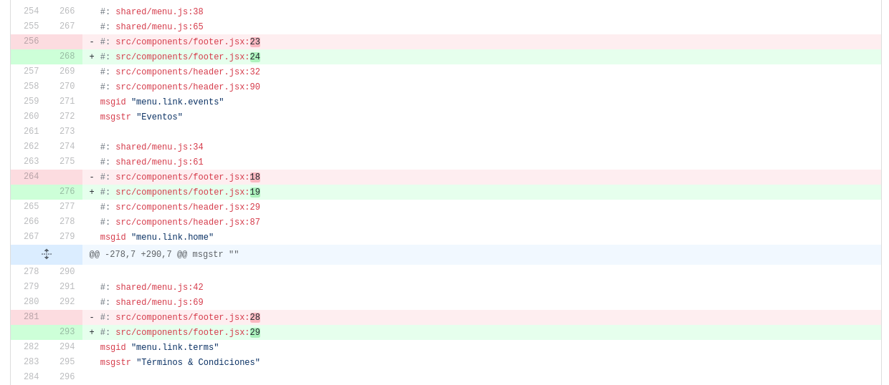
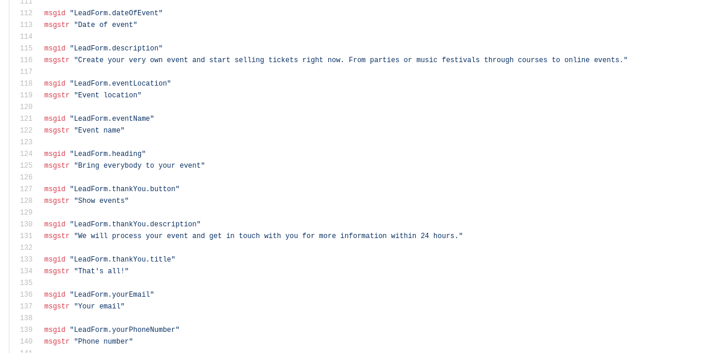

# lingui-locale-cleaner

> [!WARNING]  
> You can now achieve the same result with the [latest version of Lingui](https://lingui.dev/). This going to be obsolete from now on.

---

Simple script which removes lines with source code line numbers from .po files generated by [@lingui/react](https://www.npmjs.com/package/@lingui/react).
And makes Code Reviews easier.

## How to use

1. Install this dependency: `npm i @trisbee/lingui-locale-cleaner`
2. Run command `lingui-locale-cleaner <path_to_locale_directory>`

## Example of annoying code review

**and after using @trisbee/lingui-locale-cleaner:**

